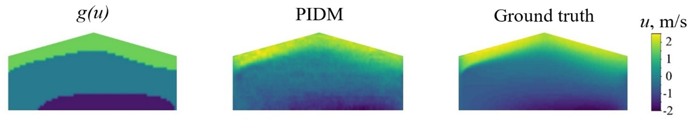

# Physics-informed Diffusion Model for Turbulent Velocity Field Reconstruction

[](https://github.com/RojanoLab/PIDM_applied_to_ag_buildings)

PyTorch implementation of

**A Physics-informed Diffusion Model Applied to Agricultural Buildings**.


A brief introduction is presented in a [poster](resources/AI_in_agriculture.pdf)

## Overview

Denoising Diffusion Probabilistic Models (DDPM) are used here to reconstruct high-fidelity 2D turbulent velocity fields (x- and y-components) for agricultural buildings from sparse or low-fidelity references. The model is trained exclusively on high-resolution velocity data and uses a **physics-informed conditioning signal** derived from the k-ε turbulence model to guide the reverse diffusion process. This conditioning enforces RANS residuals (continuity, momentum, and turbulent transport equations) during sampling, making reconstructions physically consistent from guided images.


## Project Structure

```
diffusion_final_github/
├── main.py                                      # Entry point for guided sampling / reconstruction
├── configs/
│   └── vel_256_512_conditional.yml              # Sampling configuration
├── train_ddpm/
│   ├── main.py                                  # Entry point for model training
│   ├── train.sh                                 # Training shell script
│   └── configs/
│       └── vel_256_512_conditional.yml          # Training configuration
├── runners/
│   └── rs256_guided_diffusion2.py               # Guided diffusion sampler with k-ε conditioning
├── models/
│   ├── diffusion_new.py                         # UNet (unconditional and conditional variants)
│   └── ema.py                                   # Exponential Moving Average helper
├── functions/
│   ├── denoising_step.py                        # DDPM / DDIM denoising steps
│   └── process_data.py                          # Data loading and pre-processing
├── data/
│   ├── train_Vel_X.npy                          # X-velocity training data
│   ├── train_Vel_Y.npy                          # Y-velocity training data
│   ├── train_256-512_Vel_X_stats.npz            # Normalization stats for train_Vel_X.npy
│   ├── train_256-512_Vel_Y_stats.npz            # Normalization stats for train_Vel_Y.npy
│   ├── test_Vel_X.npy                           # X-velocity test/reference data for reconstruction
│   ├── test_Vel_X_guided.npy                    # Guided signal g(u) for reconstruction
│   ├── test_Vel_Y.npy                           # Y-velocity test/reference data
│   └── mean_ke.npz                              # Kinetic energy / turbulence prior input
├── pretrained_weights/                          # Saved model checkpoints (.pth)
└── experiments/                                 # Output directory for reconstructions
```

## Dataset

The training data consists of 2D turbulent velocity fields with the following properties:

| File | Shape | dtype | Description |
|------|-------|-------|-------------|
| `train_Vel_X.npy` | `(N, T, 256, 512)` | uint8/float | X-component training fields |
| `train_Vel_Y.npy` | `(N, T, 256, 512)` | uint8/float | Y-component training fields |
| `train_256-512_Vel_X_stats.npz` | scalars | float | `mean` and `scale` for X normalization |
| `train_256-512_Vel_Y_stats.npz` | scalars | float | `mean` and `scale` for Y normalization |
| `mean_ke.npz` | arrays | float | Turbulence prior (kinetic energy) used in training/sampling |
| `test_Vel_X.npy` | `(N, T, 256, 512)` | uint8/float | X-component reference fields for reconstruction |
| `test_Vel_X_guided.npy` | `(N, T, 256, 512)` | uint8/float | Guided conditioning signal `g(u)` |
| `test_Vel_Y.npy` | `(N, T, 256, 512)` | uint8/float | Y-component reference fields |

[Download](https://figshare.com/s/5e0ff1c782faef1a7e1a) and unzip all data files to be placed inside the `./data/` subdirectory before running any experiment.

For reconstruction (sampling), the default config expects test files under `./data/`:

| File | Description |
|------|-------------|
| `test_Vel_X.npy` | Ground-truth/reference x-velocity input |
| `test_Vel_X_guided.npy` | Guided image conditioning signal `g(u)` |
| `test_Vel_Y.npy` | Ground-truth/reference y-velocity |

## Environment

```
python 3.8
PyTorch 1.7 + CUDA 10.1 + torchvision 0.8.2
TensorBoard 2.11
Numpy 1.22
tqdm 4.59
einops 0.4.1
matplotlib 3.6.2
```

## Running the Experiments

### Step 1 — Model Training

From inside the `./train_ddpm/` subdirectory, run:

```bash
bash train.sh
```

or directly:

```bash
python main.py \
    --config ./vel_256_512_conditional.yml \
    --exp ./experiments/results/ \
  --doc weights/trained_UNet_nn_ \
    --ni
```

Key training hyperparameters (set in `train_ddpm/configs/vel_256_512_conditional.yml`):

| Parameter | Value |
|-----------|-------|
| Image size | 512 × 256 |
| Channels | 3 |
| Batch size | 12 |
| Epochs | 1 000 |
| Iterations | 200 000 |
| Optimizer | Adam (lr = 2e-4) |
| Diffusion timesteps | 1 000 |
| Snapshot frequency | every 20 000 iterations |

Checkpoints are saved to:

```
train_ddpm/experiments/results/logs/weights/trained_UNet_nn_/
```

You can change the output location via the `--exp` and `--doc` arguments.

### Step 2 — Physics-informed Reconstruction (Sampling)

Place the trained checkpoint (e.g., `ckpt_Vel_X.pth`) available [here](https://figshare.com/ndownloader/files/63056209?private_link=06434d6d5cfdda10b811) into `./pretrained_weights/` accordingly in `configs/vel_256_512_conditional.yml`.

From the **root** directory of the repository, run:

```bash
python main.py \
  --config vel_256_512_conditional.yml \
    --seed 1234 \
    --sample_step 1 \
    --t 1000 \
    --r 20
```

Key sampling arguments:

| Argument | Description |
|----------|-------------|
| `--t` | Forward diffusion noise scale (number of timesteps to corrupt the reference) |
| `--r` / `--reverse_steps` | Number of reverse (denoising) steps |
| `--seed` | Random seed for reproducibility |
| `--sample_step` | Number of sampling repetitions |

The `guidance_weight` in the config controls the strength of the k-ε physics residual signal during sampling. Results are saved under `./experiments/` in a subfolder named after the run parameters (e.g., `guided_recons__t1000_r20_w3.0/`).


## References

This implementation is based on / inspired by:
- [https://github.com/BaratiLab/Diffusion-based-Fluid-Super-resolution](https://github.com/BaratiLab/Diffusion-based-Fluid-Super-resolution)(A Physics-informed Diffusion Model for High-fidelity Flow Field Reconstruction)
- [https://github.com/ermongroup/SDEdit](https://github.com/ermongroup/SDEdit) (SDEdit: Guided Image Synthesis and Editing with Stochastic Differential Equations)
- [https://github.com/ermongroup/ddim](https://github.com/ermongroup/ddim) (Denoising Diffusion Implicit Models)
